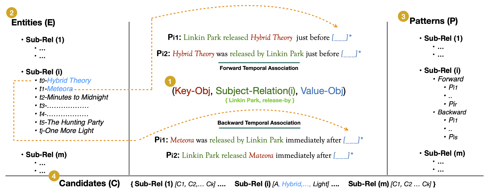

<h1 align="center">
<br>
TeCFaP: Temporally Consistent Factuality Probing for Large Language Models
</h1>


<p align="center">
  <a href="https://www.lcs2.in/"><b>[🌐 Website]</b></a> •
  <a href="https://arxiv.org/abs/2409.14065"><b>[📜 Paper]</b></a> •
  <a href="https://github.com/ab-iitd/tecfap/"><b>[🐱 GitHub]</b></a>
  
</p>


<p align="center">
Repo for "<a href="https://arxiv.org/abs/2409.14065" target="_blank">Temporally Consistent Factuality Probing for Large Language Models</a>"
</p>


## 🔥 News

- [2024/09/28] TEMP-COFAC dataset is release over Git !
- [2024/09/20] TeCFaP is accepted by EMNLP 2024 (main conference) !


## 💡 Framework

<p align="center" width="100%">
    
</p>


## 💡 Abstract

<details close>
<summary> Abstract of TeCFaP</summary>

The prolific use of Large Language Models (LLMs) as an alternate knowledge base requires them to be factually consistent, necessitating both correctness and consistency traits for paraphrased queries. Recently, significant attempts have been made to benchmark datasets and metrics to evaluate LLMs for these traits. However, structural simplicity (subject-relation-object) and contemporary association in their query formulation limit the broader definition of factuality and consistency. In this study, we introduce TeCFaP, a novel Temporally Consistent Factuality Probe task to expand the consistent factuality probe in the temporal dimension. To this end, we propose TEMP-COFAC, a high-quality dataset of prefix-style English query paraphrases. Subsequently, we extend the definitions of existing metrics to represent consistent factuality across temporal dimension. We experiment with a diverse set of LLMs and find most of them performing poorly on TeCFaP. Next, we propose a novel solution CoTSeLF (Consistent-Time-Sensitive Learning Framework) combining multi-task instruction tuning (MT-IT) with consistent-time-sensitive reinforcement learning (CTSRL) to improve temporally consistent factuality in LLMs. Our experiments demonstrate the efficacy of CoTSeLF over several baselines.

</details>


## 🔧 Repo Structure
This repo contains the training scripts and TEMP-COFAC dataset. Detailed structure is as follow:
```
.
├── README.md
├── src
├── dataset
    ├──temp-cofac
```

## Citation
If you find it helpful, please kindly cite the paper.
```
@misc{bajpai2024temporallyconsistentfactualityprobing,
      title={Temporally Consistent Factuality Probing for Large Language Models}, 
      author={Ashutosh Bajpai and Aaryan Goyal and Atif Anwer and Tanmoy Chakraborty},
      year={2024},
      eprint={2409.14065},
      archivePrefix={arXiv},
      primaryClass={cs.CL},
      url={https://arxiv.org/abs/2409.14065}, 
}
```